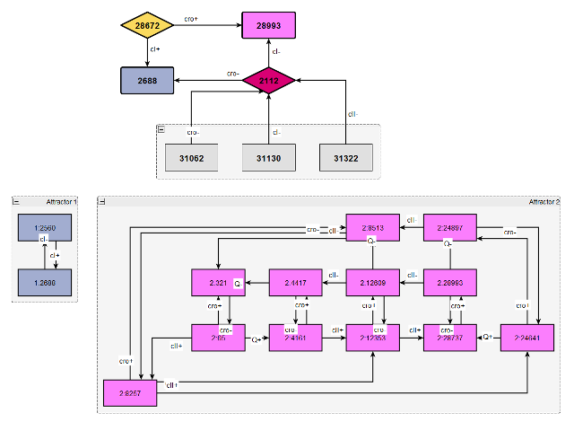

# RepresentationGraphBuilder
Python program modules for building Representation Graphs for gene regulatory network state spaces created using Hybrid System Model (HSM) framework.

## Getting started

Clone this repository locally and run Python scripts from the `bin` directory. It contains two scripts: 

- `build_rgraphs_file.py`: builds representation graph for the given input file
- `build_rgraphs_all.py`: builds representation graphs for all input files from the given directory

## Requirements: 

The scripts have been tested with Python release versions 3.8.1 and 3.10.12 on Windows and Ubuntu Linux operating systems, compatibility with range of other Python 3.0 versions could be expected. 
The scripts require the following Python packages to be inatalled: `NumPy`, `NetworkX`, `igraph` and `N2G` (and have been tested specifically with the package versions: `numpy-1.24.4`, `netwrokx-3.1`, `igraph-0.11.4` and `N2G-0.3.3`).   

## Usage: 

For computing representation graph for the given input file:

```
python build_rgraphs_file.py -i <source file> -o <destination file (graph)> [-draw <destination file (graphml)>] [-ini] [-s]
```

where:

- `<source file>`: the input file containing HSM model state space in syntactically right format
- `<destination file (graph)>`: the output file containing representation graph and its attractors 
- `<destination file (graphml)>` (optional): the output file containing visualisations of representation graph and attractors in graphml format (can be viewed and edited with e.g. yEd Graph Editor)  
- `-ini` (optional): if provided, compute representation graph only for the part of the state space from the given initial state (INI state should be included in input file) 
- `-s` (optional): run silently

For computing representation graphs for all input files from the given directory:

```
python build_rgraphs_all.py <source dir> <destination dir> [-draw] [-ini]
```

This calls `build_rgraphs_file.py` script for all files in input directory `<source dir>` and saves its output in `<destination dir>`.
The both directories should exist and `<source dir>` should contain only syntactically correct HSM model state space files. The arguments `-draw` and `-ini`, if provided, are passed to `build_rgraphs_file.py` script.
The naming conventions of files are as follows: the representation graph of input file `filname.*` will be saved in file `filname_rg.txt`, 
the drawing of representation graph will be saved in file `filename_rg.graphml`.   

## Examples

The `models` directory contains sample input and output files for lambda phage, HK022 phage and Mu phage viruses HSM models, and for myeloid cell differentiation model 
(the latter should be analysed with `-ini` flag). The input files of HSM state spaces have been generated by programs from
[https://github.com/IMCS-Bioinformatics/HybridSystemModels](https://github.com/IMCS-Bioinformatics/HybridSystemModels) repository. 
Sample visualisations of the obtained representation graphs by yEd Graph Editor (after applying cosmetic layout changes and node groupings) are shown below:

Representation graph and 4 steady state attractors for myeloid cell differentiation 'base model':

  

Representation graph and lysis and lysogeny attractors for a typical HSM frame of HK022 phage model:

  

## The last update notes: 

Version 1.0.18, 21.03.2024

   

